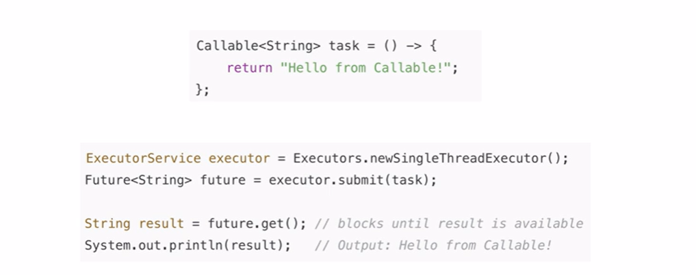
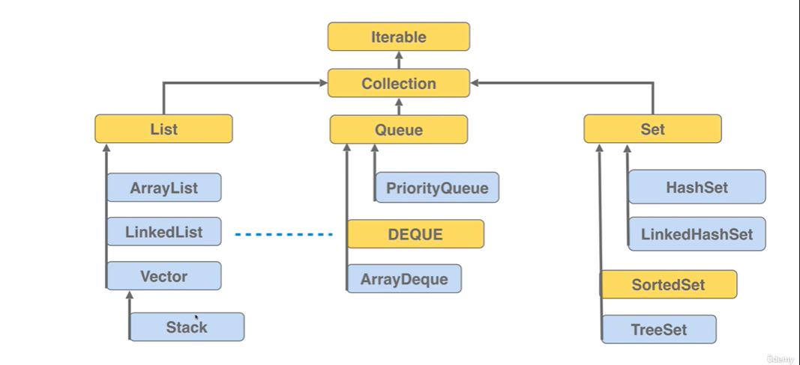
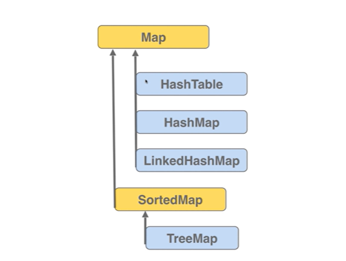

# java-multithreading
Concurrency, Multithreading and parallelization

## Implementing Runnable Interfaces using lambda expressions

```java
Runnable r1=()->{
    for(int i=0;i<10;i++){
        System.out.println("Runner1: "+i);
    }
};
```

## Implementing Runnable interfaces using anonymous Inner Class

```java
Thread t1 = new Thread(new Runnable() {
    @Override
    public void run() {
        /// Your method
    }
});
```

## Instantiating Runner class by extending Thread class (exhibiting Interrupted Exception by using Thread.sleep class)

```java
class Runner1 extends Thread{
    
    @Override
    public void run(){
        ///Your method
        for(int i=0;i<10;i++){
            try {
                Thread.sleep(100);
            } catch (InterruptedException e) {
                throw new RuntimeException(e);
            }
            System.out.println("Runner1: "+i);
        }
    }
}

public static void main(String[] args) {
    Thread t1=new Runner1();
    t1.start();
    
    // Waiting for the thread to complete its implementation we use join method in try-catch block
    try{
        t1.join();
    }catch(InterruptedException e){
        throw new RuntimeException(e);
    }
    System.out.println("Finished with the t1 runner");
}
```
#### Listing the threads in java
```java
for(Thread t: Thread.getAllStackTraces.keySet()){
    System.out.println("Thread name: " + t.getName() + ", State: "+t.getState());
        }
```

#### Daemon Threads and Worker Threads
**Worker Threads** are not terminated by JVM. It waits for it to Finish.

**Daemon Threads** are ***Background Threads*** that stop when worker/user threads cease to exist

##### To set Daemon Threads
```java
t2.setDaemon(true); // By default it is set to false for all the threads
```

#### Setting priority of threads
```java
Thread low = new Thread(new Task(),"Low Priority Thread");
Thread medium = new Thread(new Task(),"Medium Priority Thread");
Thread high = new Thread(new Task(),"High priority task");

low.setPriority(Thread.MIN_PRIORITY);
medium.setPriority(Thread.NORM_PRIORITY);
high.setPriority(Thread.MAX_PRIORITY);
```
### Stack Memory and Heap Memory
| Stack | Heap |
| ---   | --- |
| Stores Method Calls, local variables and reference variable | Stores Objects and instance variables |
| Smaller in size, faster to access | larger in size, slower to access |
| Exists for the lifetime of the method calls, and automatically managed | Objects exists until they are garbage collected, memory also dynamically allocated |
| Every thread has its own stack | Heap memory is shared among threads |

### Synchronized (To efficiently handle concurrent processes in Heap Memory)

To ensure that the thread access one resource at a time. The increment method will be accessed only by one thread at a time.
```java
public synchronized static void increment(){
    counter++;
}
```
Every Java object has an intrinsic lock(monitor lock) associated with it
Built-in mechanism for JVM provides for synchronization  
Synchronized keyword makes a thread acquire the monitor lock to access that particular code  
Since every Java Object has only one intrinsic lock associated with it, when we declare multiple synchronized on various methods, all of them compete for one single intrinsic lock, which makes the process really slow.

**For fine-grained control**,  
Instead of  
```java
public synchronized void method1(){}
```
We can do  
```java
public void method1(){
    /// We can apply the lock only to method where we need control
    synchronized (this){
        
    }
}
```

For multiple locks and multiple process:  
```java
private Object object1= new Object();
private Object object2 = new Object();

public void method1(){
    /// We can apply the lock only to method where we need control
    synchronized (object1){

    }
}

public void method2(){
    /// We can apply the lock only to method where we need control
    synchronized (object2){

    }
}
```

Class-based locking and Object-based locking
```java
private static int counter1=0;

synchronized(ThreadExample.Class){
    counter1++;
}
```

Or

```java
class ClassLocking {
    private static void synchronized Method1() {

    }
}

Runnable task1= ClassLocking::instanceMethod;
new Thread(task1, "First Thread").start();
```

***Re-entrant Locks***
```java
public class ReentrantExample {
 
    public synchronized void outerMethod() {
        System.out.println("Entered outerMethod");
        innerMethod(); // Calling another synchronized method
        System.out.println("Exiting outerMethod");
    }
 
    public synchronized void innerMethod() {
        System.out.println("Entered innerMethod");
        // Do something
        System.out.println("Exiting innerMethod");
    }
 
    public static void main(String[] args) {
        ReentrantExample example = new ReentrantExample();
 
        Thread thread = new Thread(() -> {
            example.outerMethod();
        });
 
        thread.start();
    }
}
```
In this example, we should see that when a thread enters _outerMethod_ it calls _innerMethod_ and it enters without any issue because of re-entrant locks  

#### Producer-Consumer problem
```java
class Process{
    public void produce() throws InterruptedException{
        synchronized (this){
            System.out.println("In the prodcer method");
            wait(); // Release the lock
            System.out.println("Going to exit produce method");
        }
        
    }
    
    public void consume() throws InterruptedException{
        Thread.sleep(1000);
        
        synchronized (this){
            System.out.println("Running the same method...");
            notify();
            System.out.println("After the notify() method call in the consume method");
        }
        
    }
}
```

```java
public static void main(String[] args){
    var process=new Process();
    Thread t1=new Thread(()->{
        try{
            process.produce();
        }catch(InterruptedException e) (
                throw new RuntimeException(e);
        )
    });

    Thread t2=new Thread(()->{
        try{
            process.consume();
        }catch(InterruptedException e) (
        throw new RuntimeException(e);
        )
    });
    
    t1.start();
    t2.start();
    
}
```

It is non-deterministic so it doesn't rewards the longest-waiting thread(_Thread Starvation and Fairness_)  
***Difference between Wait and Sleep***  
Sleep is called on the **Thread**, while wait is called on the **Object**.  
Wait is an interrupter (That's why we need InterruptedException)  
**Wait** and **Notify** must happen in a synchronized block on the monitor object whereas sleep does not.  
Sleep operation does not release the locks it holds while on the other hand Wait releases the lock on the object that wait() is called on.

#### Resolving Producer and Consumer Problem

```java
import java.util.LinkedList;

class SharedBuffer {
    private List<Integer> buffer = new LinkedList<>();
    private int capacity;
    
    // 1st Thread pushes task 1,2,3,4,5
    //2nd Thread pops 5,4,3,2,1
    public synchronized void produce() throws InterruptedException{
        if(buffer.size()==capacity){
            System.out.println("Buffer full, producer waiting...");
            wait();
        }
        System.out.println("Adding items with the producer...");
        
        for(int i=0;i<capacity;i++){
            buffer.add(i);
            System.out.println("Added value: "+i);
        }
        notify();
    }
    public synchronized void consume() throws InterruptedException{
        if(buffer.size()<capacity){
            System.out.println("Buffer not full yet, consumer waiting...");
            wait();
        }
        
        while(!buffer.isEmpty()){
            int item=buffer.remove(0);
            System.out.println("Consumer removes: "+item);
            Thread.sleep(300);
        }
        
        notify();
    }
}
class Consumer implements Runnable{
    private SharedBuffer sharedBuffer;
    
    public Consumer(SharedBuffer sharedBuffer){
        this.sharedBuffer=sharedBuffer;
    }
    
    @Override
    public void run(){
        try{
            while(true){
                this.sharedBuffer.consume();
                Thread.sleep(500);
            }
        }catch(InterruptedException e){
            throw new RuntimeException(e);
        }
    }
}

class Producer implements Runnable{
    private SharedBuffer sharedBuffer;

    public Producer(SharedBuffer sharedBuffer){
        this.sharedBuffer=sharedBuffer;
    }

    @Override
    public void run(){
        try{
            while(true){
                this.sharedBuffer.produce();
                Thread.sleep(500);
            }
        }catch(InterruptedException e){
            throw new RuntimeException(e);
        }
    }
}
public class App {
    public static void main(String[] args) {
        var sharedBuffer=new SharedBuffer();
        
        Thread t1=new Thread(new Producer(sharedBuffer));
        Thread t2=new Thread(new Consumer(sharedBuffer));
        
        t1.start();
        t2.start();
    }
}
```

#### Joshua's Bloch Approach - When a thread wakes up spuriously

```java
while(buffer.size()<capacity){
            System.out.println("Buffer not full yet, consumer waiting...");
            wait();
}
```
While protects from:  
1. Multiple threads waking up simultaneously( As they have to check condition again and again in while loop). With the if loop, they don't check the condition again and they proceed
2. The condition may not be valid when they proceed with the logic
3. JVM spuriosly wakes up Thread, when no new notification

***Locks and Reentrant Locks***

**Lock**: A Java Interface more flexible than synchronized
**Re-entrant Locks**: Concrete Implementation of Lock as the thread that holds the lock can acquire it again and again without getting blocked

__Re-entrant Locks__ example:

```java
import java.util.concurrent.locks.ReentrantLock;

ReentrantLock lock=new ReentrantLock(true); // When marked true, it is FIFO(First-come, first served)

```
Fair lock ensures fairness and order, although slightly more overhead becase of maintaining the queue.  
While unfair lock result in higher throughput because of less context switches(we use it when performance is more important).  

```java
private static Lock lock=new ReentrantLock(true);

public static void increment(){
    try{
        lock.lock();
    }finally {
        lock.unlock();
        //unlock() We can unlock in some other part of the code too, if we want in case of Re-entrant lock
    }
}
```

```java
Class Worker{
private Lock lock = new ReentrantLock();
private Condition condition = lock.newCondition();

public void produce() throws InterruptedException {
    lock.lock();
    System.out.println("Produce method...");
    // wait
    condition.await();
    System.out.println("Again the producer method...");
    lock.unlock();
}

public void consume() throws InterruptedException {
    Thread.sleep(2000);
    lock.lock();
    System.out.println("Consumer method...");
    Thread.sleep(3000);
    // notify
    condition.signal();
    lock.unlock();
}
}

public class App {
    public static void main(String[] args) {
        Worker worker = new Worker();

        Thread t1 = new Thread(new Runnable() {
            @Override
            public void run() {
                try{
                    worker.produce();
                } catch (InterruptedException e) {
                    e.printStackTrace();
                }
                
            }
        });


        Thread t2 = new Thread(new Runnable() {
            @Override
            public void run() {
                try{
                    worker.consume();
                } catch (InterruptedException e) {
                    e.printStackTrace();
                }

            }
        });
        t1.start();
        t2.start();
        
        try{
            t1.join();
            t2.join();
        }catch (InterruptedException e){
            e.printStackTrace();    
        }
        
    }
}
```
|                                        Re-entrant Lock | Synchronized |
|-------------------------------------------------------:|--------------|
| _tryLock()_: Let you acquire the lock without blocking | Not possible |
|_tryLock(timeout, unit)_: Allows waiting for a certain time | Not supported |
| _lockInterruptibly()_: Interrupts the thread while in waiting state | Thread is blocked until lock is acquired |
| FIFO | No order |
| Multiple condition support __Condition()__ via __newCondition()__ | only __wait()__ and __notify()__ |
| Manual control of locks through _lock()_ and _unlock()_ method | Automatically managed by JVM |

- [X] Checked Exceptions: Todo
- [ ] Unchecked Exceptions: Todo

## Multi-Threading Concepts

| Deadlock | Livelock |
| --- | --- |
| Blocked, do nothing | Running but not making any progress |
| Each waiting for a lock | Each thread keeps responding to others |
| Frozen | Active |

### Locks and Cyclic Dependency

**Locks**: Thread should not be blocked indefinitely so we use _tryLock()_ method.  
**Avoid Cyclic Depenedency**: Each thread acquires the lock in same order to avoid any cyclic dependency in lock acquisition.  
**Randomness**: Especially in livelock, threads should try to acquire the locks randomly.

### Volatile
Java Threads executed by two independent CPU may cache the variables locally within its scope (Cache->Stack->CPU (_comprised by a Thread_))

To ensure that the thread initiated updates are visible to other threads as well, we use volatile keyword. A light synchronization mechanism ensuring a particular thread updates are visible to other threads.

**Volatile** enables the variable to be read from CPU (Main memory) instead of Cache memory  
Sometimes, variable maybe written to the main memory or they share the same cache or scope of a thread, so they may read from the same source without facing any inconsistency.  


### Atomic Integer
- Supports atomic operations, as `counter++` is not an atomic operation, so to handle this concurrently, we should be using `synchronized` keyword on its function
- Atomic Integer supports atomic operations, `counter.getAndIncrement()` is one such example.
- It supports ATomic operation for a single operation.
- If we do:  
```java
if(counter.get<10){
    counter.getAndIncrement();    
}
```
It may throw inconsistent result.

```java
public class AtomicInteger {
    private static AtomicInteger counter = new AtomicInteger(0);

    public static void main(String[] args) {
        Thread t1 = new Thread(new Runnable() {
            @Override
            public void run() {
                increment();
            }
        });

        Thread t2 = new Thread(new Runnable() {
            @Override
            public void run() {
                increment();
            }
        });
        t1.start();
        t2.start();
        try{
            t1.join();
            t2.join();
        }catch(InterruptedException e){
            e.printStackTrace();
        }

    }

    public static void increment() {
        for(int i=0;i<10000;i++){
            counter.getAndIncrement();
        }
    }
}
```

#### Semaphores
Introduced by Djikstra  
Before Semaphore, no method was there to manage critical sections or shared resources between Thread and Process.  
Simple variables which can safely control access to shared resources and critical sections in concurrent systems.  
**Binary Semaphore**: Mutual Exclusion, a thread can access one resource at a time. _0_ if it is acquired, _1_ if it's available.  
**Counting Semaphore**: Arbitrary number(until it gets to zero) as a resource count, used when multiple resources available (10 DB connections, 5 thread pools).  
---

- Only maintain count, not the specifics
- Can work as a trigger for some useful web actions to be initiated
- Producer-Consumer problem can be implemented using Djikstra.

#### Mutex (Mutual Exclusion)

A Mutex( Mutual Exclusion ): A programming construct ensuring Thread Safety, by ensuring that multiple threads can't access the critical section at the same time.  
Only one thread can hold Mutex, and execute the code, other threads would be blocked from accessing it.  

| Mutex | Semaphore |
| --- | --- |
| Mutual Exclusion(One thread at a time) | Signalling, coordination and resource counting |
| Only One | Can be any arbitrary non-negative number |
| Has a single owner | No concept of ownership |
| Protects critcal section | Controls access to limited number of resources |
| Blocks if already locked | Blocks if count is 0 |
| Must be released by the thread which acquired it | Anyone can release it |
| `synchronized`, `ReentrantLock` | `Semaphore` from `java.util.concurrent` |

#### Semaphore coding example

```java
import java.util.concurrent.ExecutorService;
import java.util.concurrent.Executors;
import java.util.concurrent.Semaphore;

enum Downloader {
    INSTANCE;

    private Semaphore semaphore = new Semaphore(3, true);

    public void download() {
        try {
            semaphore.acquire();
            downloadData();
        } catch (InterruptedException e) {
            e.printStackTrace();
        } finally {
            semaphore.release();
        }
    }

    private void downloadData() {
        try {
            System.out.println("Downloading data from the web...");
            Thread.sleep(2000);
        } catch (InterruptedException e) {
            e.printStackTrace();
        }
    }
}

public class App {
    public static void main(String[] args) {
        ExecutorService service = Executors.newCachedThreadPool();

        for (int i = 0; i < 12; i++) {
            service.execute(new Runnable() {
                @Override
                public void run() {
                    Downloader.INSTANCE.download();
                }
            });
        }
    }
}
```

## Importance of Thread Pools

- Each Thread required 512 KB to 1 MB
- With each thread having its own execution context and competing for CPU, context-switching becomes a costly operation
- Manually handling each threads, joining the threads if necessary and handling exception.

**Thread Pools**:A collection of Worker Thread being reused to execute many tasks.

**ExecutorService** provides with threads and its implementations.
If all threads are busy, tasks are submitted to **BlockingQueue** data structure.  

`newFixedThreadPool(n)`: Initiated lazily,created on demand based on `corePoolSize`.

`newCachedThreadPool()`: Creates new threads as needed and reuses previously constructed threads when available.  
Removes idle threads after short timeout (usually 60 seconds)
Useful for short-lived, asynchronous tasks.

`newSingleThreadExecutor()`: Have only one worker thread, used to execute tasks sequentially and uses unbounded queue to sequence tasks in the waiting.  

`newScheduledThreadPool(n)`: Schedules task to run after a delay or schedule tasks to run periodically.  

If thread pool size is small, and scheduled tasks are long-running, it can result into thread-starvation. New tasks may be delayed. Use it to schedule tasks at regular intervals.  
#### Advantages of ThreadPool

- Submit tasks that return values using Callable and result wrapped in Future objects  
- No need to manually manage start() and join()  
- Threads are created once and can be reused for various tasks. Reduces overhead of thread creation and destruction.  

---

#### SingleThread Executor

```java
import java.util.concurrent.ExecutorService;
import java.util.concurrent.Executors;
import java.util.concurrent.TimeUnit;

class Task implements Runnable {
    private int id;

    public Task(int id) {
        this.id = id;
    }

    @Override
    public void run() {
        System.out.println("Task with id: " + id + " is in work - thread id: " + Thread.currentThread().getName());
        long duration = (long) (Math.random() * 5);

        try {
            TimeUnit.SECONDS.sleep(duration);
        } catch (InterruptedException e) {
            Thread.currentThread().interrupt();
        }
    }
}

public class SingleThreadExecutor {
    public static void main(String[] args) {
        ExecutorService executorService = Executors.newSingleThreadExecutor();
        
        for(int i=0;i<5;i++){
            executorService.execute(new Task(i));
        }
        executorService.shutdown();
        try{
            if(!executorService.awaitTermination(1000,TimeUnit.MILLISECONDS)){
                executorService.shutdownNow();// If we want to ensure that executor stops immediately, otherwise comment this code to proceed with remaining tasks
            }
        }catch (InterruptedException e){
            executorService.shutdownNow();
        }
        
    }
}
```
#### Advantages of ThreadPoolExecutor

- Decouples task submission from execution:Submission of tasks without blocking main thread
- Multiple tasks can be queued up and they will be executed one after another so the lifecycle management of threads become easier.
- Tasks are run sequentially, so critical section are managed to avoid concurrency bugs.  

#### Fixed Thread Pool Executor Service

```java
ExecutorService executorService = Executors.newFixedThreadPool(10); // A fixed thread pool of 10 threads handling tasks and being reused again and again to manage tasks
```

#### ScheduledExecutor

```java
import java.util.concurrent.Executors;
import java.util.concurrent.ScheduledExecutorService;
import java.util.concurrent.TimeUnit;

class StockMarketUpdater implements Runnable {

    @Override
    public void run() {
        System.out.println("Updating and downloading data from the stock Market..");
    }
}

public class App {
    public static void main(String[] args) {
        ScheduledExecutorService executor = Executors.newScheduledThreadPool(1);
        executor.scheduleAtFixedRate(new StockMarketUpdater(), 1000, 2000, TimeUnit.MILLISECONDS);
    }
}
```

### Difference between Runnable and Callable
| Runnable | Callable |
|--- | --- |
|A task doesn't return anything | It returns a generic type (Type V) |
| Can't throw a checked exception | It can throw a checked exception |
| Can be executed using both _execute()_ and _submit()_ method | Only be executed with _submit()_ method of an _ExecutorService()_ that returns with **Future** object containing the result. | 



#### Virtual Threads consider `future.get()` as a non-blocking operation at OS level

Callable method:

```java
import java.util.ArrayList;
import java.util.concurrent.Callable;
import java.util.concurrent.ExecutionException;
import java.util.concurrent.ExecutorService;
import java.util.concurrent.Executors;

class Processor implements Callable<String> {
    private int id;

    public Processor(int id) {
        this.id = id;
    }

    @Override
    public String call() throws Exception {
        Thread.sleep(2000);
        return "Id: " + id;
    }

}

public class App {
    public static void main(String[] args) {
        ExecutorService service = Executors.newFixedThreadPool(2);
        List<Future<String>> list = new ArrayList<>();
        for (int i = 0; i < 5; i++) {
            Future<String> future = service.submit(new Processor(i + 1));
            list.add(future);
        }
        for (Future<String> f : list) {
            try {
                System.out.println(f.get());
            } catch (InterruptedException | ExecutionException e){
                e.printStackTrace();
            }
        }
    }
}
```

### TO ensure synchronization along Collections Iterable List etc.
**Note**: It is blocking since it uses Intrinsic Lock
```java
List<Integer> nums=Collections.synchronizedList(new ArrayList<>());
```



    
**Only Vector, Stack and HashTable are Thread Safe(Although we dont use HashTable, we use ConcurrentHashMap)**

**To resolve synchronization and concurrency more effectively**  

`CountDownLatch`: Decouples wait/count logic more effectively.(Watch from 9:00 Playback Udemy Video)
